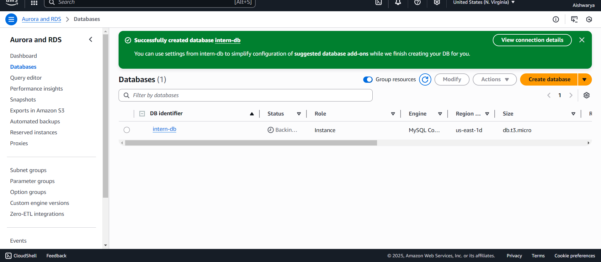
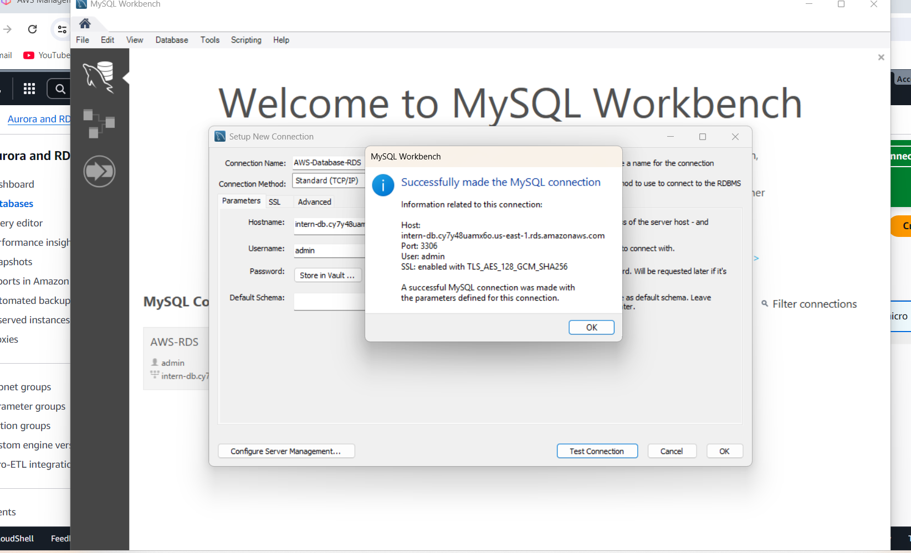
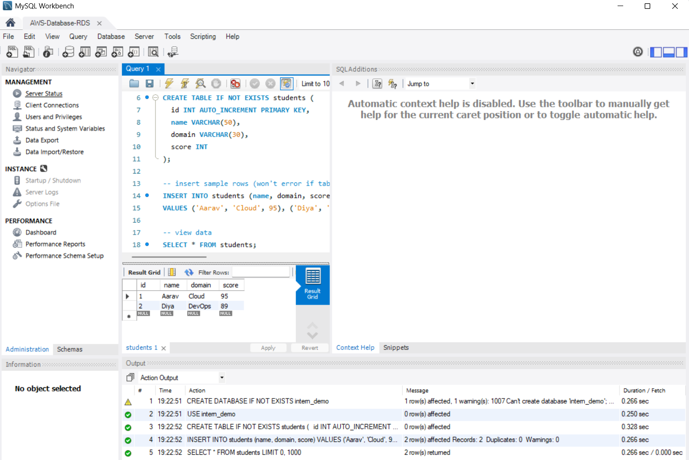

# Cloud-Database-Practical
Cloud database instance creation and connection task (AWS RDS + MySQL Workbench)

# Task 5: Create and Connect to a Cloud Database Instance

## Objective
To understand how cloud databases work by creating a managed SQL database instance (MySQL) in AWS, connecting to it, and performing basic operations.  
This helped me learn database provisioning, connectivity, and CRUD operations in a cloud-managed environment.

---

## Steps I Followed

1. **Created an RDS Instance**
   - Logged into the AWS Management Console and opened the RDS service.
   - Selected **Create database** → **Standard Create** → **MySQL**.
   - Used the **Free Tier** option and named the instance `intern-db`.
   - Set a username and password, then launched the instance.

2. **Configured Access**
   - Enabled **Public Access**.
   - Added my local system’s IP in the **Inbound Rules** of the security group to allow MySQL traffic (port 3306).

3. **Connected Using MySQL Workbench**
   - Installed **MySQL Workbench** on my system.
   - Used the endpoint from AWS RDS, username, and password to connect successfully.

4. **Performed SQL Operations**
   - Created a new database and table.
   - Inserted sample data and viewed the output.

5. **Cleaned Up**
   - Deleted the RDS instance after testing to avoid extra usage.

---

## What I Learned
- How to create and configure an AWS RDS instance.
- How to connect a local client (MySQL Workbench) to a cloud-hosted database.
- Basic SQL operations (create, insert, select).
- The concept of Database-as-a-Service (DBaaS) and remote database management.

---

## Screenshots





---

## SQL Commands Used

```sql
CREATE DATABASE intern_demo;
USE intern_demo;

CREATE TABLE students (
  id INT AUTO_INCREMENT PRIMARY KEY,
  name VARCHAR(50),
  domain VARCHAR(30),
  score INT
);

INSERT INTO students (name, domain, score)
VALUES ('Aarav', 'Cloud', 95), ('Diya', 'DevOps', 89);

SELECT * FROM students;
